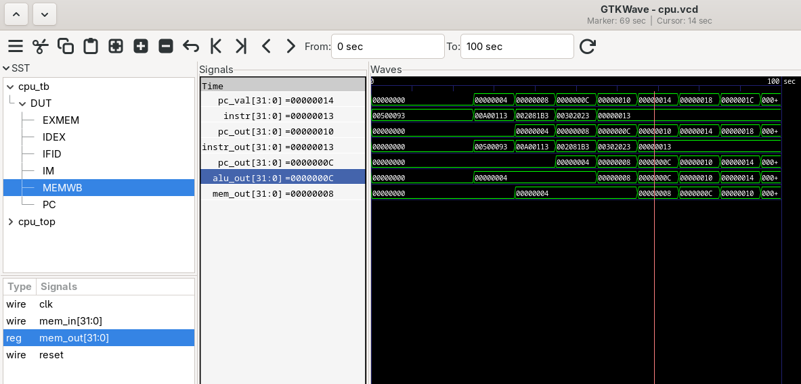

# 5-Stage Pipelined RISC-V CPU (Verilog)

## Overview

This project implements a **simplified 32-bit RISC-V pipeline architecture** using **Verilog HDL**.
The design demonstrates how instructions move through a classic **5-stage pipeline** used in modern processors.

The processor is implemented as a **pipeline skeleton**, meaning it focuses on the **pipeline datapath and stage registers**, allowing clear observation of instruction flow through the stages.

The design was simulated using **Icarus Verilog**, visualized using **GTKWave**, and can be synthesized to view its schematic using **Yosys**.

---

# Pipeline Architecture

The processor follows the classical **5-stage RISC pipeline**:

```
IF → ID → EX → MEM → WB
```

| Stage | Description         |
| ----- | ------------------- |
| IF    | Instruction Fetch   |
| ID    | Instruction Decode  |
| EX    | Execute (ALU stage) |
| MEM   | Memory stage        |
| WB    | Writeback stage     |

Each instruction advances one stage per clock cycle.

Example pipeline flow:

| Cycle | IF | ID | EX | MEM | WB |
| ----- | -- | -- | -- | --- | -- |
| 1     | I1 |    |    |     |    |
| 2     | I2 | I1 |    |     |    |
| 3     | I3 | I2 | I1 |     |    |
| 4     | I4 | I3 | I2 | I1  |    |
| 5     | I5 | I4 | I3 | I2  | I1 |

---

# Project Structure

```
riscv_pipeline_cpu
│
├── src
│   ├── pc.v
│   ├── instr_mem.v
│   └── cpu_pipeline.v
│
├── pipeline
│   ├── IF_ID.v
│   ├── ID_EX.v
│   ├── EX_MEM.v
│   └── MEM_WB.v
│
├── tb
│   └── cpu_tb.v
│
├── program
│   └── program.hex
│
├── synth.ys
├── run.sh
└── README.md
```

---

# Modules

### Program Counter

`pc.v`

Maintains the current instruction address.

```
PC(n+1) = PC(n) + 4
```

---

### Instruction Memory

`instr_mem.v`

Stores instructions loaded from `program.hex`.

Unused memory locations are filled with **NOP instructions**.

---

### Pipeline Registers

| Module | Function                             |
| ------ | ------------------------------------ |
| IF_ID  | Fetch → Decode pipeline register     |
| ID_EX  | Decode → Execute pipeline register   |
| EX_MEM | Execute → Memory pipeline register   |
| MEM_WB | Memory → Writeback pipeline register |

These registers store intermediate values between stages.

---

### CPU Pipeline

`cpu_pipeline.v`

Connects all modules together and forms the pipeline datapath.

---

# Running the Simulation

### Compile and run

```
./run.sh
```

The script performs:

```
iverilog compilation
simulation execution
GTKWave launch
```

---

# GTKWave Simulation

After simulation, the waveform viewer will open.

Expand the hierarchy:

```
cpu_tb
 └── DUT
      ├── IFID
      ├── IDEX
      ├── EXMEM
      └── MEMWB
```

Add the following signals:

```
pc_val
instr
IFID.instr_out
IDEX.pc_out
EXMEM.alu_out
MEMWB.mem_out
```

---

# Example Pipeline Waveform

Below is the GTKWave screenshot showing instructions flowing through the pipeline stages.



Each instruction shifts through the stages across clock cycles, demonstrating the pipelined execution model.

---

# Expected Signal Behavior

### Program Counter

```
0
4
8
12
16
20
```

---

### Instruction Fetch

```
inst1
inst2
inst3
inst4
```

---

### Pipeline Registers

| Stage  | Behavior                        |
| ------ | ------------------------------- |
| IF_ID  | Instruction delayed by 1 cycle  |
| ID_EX  | Instruction delayed by 2 cycles |
| EX_MEM | Instruction delayed by 3 cycles |
| MEM_WB | Instruction delayed by 4 cycles |

---

# Synthesis and Schematic Generation

The design can be synthesized using **Yosys** to generate a schematic.

### `synth.ys`

```
read_verilog src/*.v pipeline/*.v
hierarchy -top cpu_pipeline
proc
opt
techmap
opt
show -format pdf -prefix cpu_pipeline
```

---

### Run synthesis

```
yosys synth.ys
```

This generates:

```
cpu_pipeline.pdf
```

---

---

# Tools Used

Simulation:

* Icarus Verilog

Waveform visualization:

* GTKWave

RTL synthesis and schematic generation:

* Yosys

---

# Learning Objectives

This project demonstrates:

* Verilog RTL design
* Pipeline architecture
* Instruction flow in processors
* Pipeline register design
* Hardware simulation and debugging
* RTL synthesis and schematic generation

---

# Possible Extensions

This design can be extended to include:

* Hazard detection unit
* Forwarding unit
* Branch prediction
* Full RV32I instruction execution
* Cache memory integration
* FPGA implementation

---

# Author

Harshu Prasad Shukla
B.Tech Electronics and Communication Engineering
IIIT Guwahati
# 5-Stage-Pipelined-RISC-V-CPU-Verilog-
# 5-Stage-Pipelined-RISC-V-CPU-Verilog-
